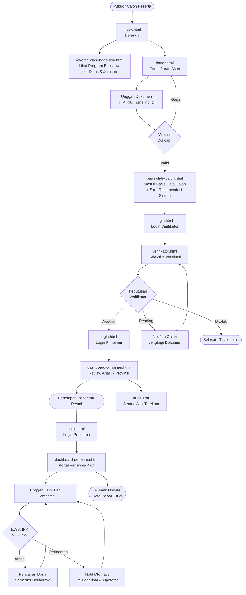

# 🎓 SMART BEASISWA SULTENG

**Sistem Manajemen & Integrasi Data Beasiswa Provinsi Sulawesi Tengah**

Testing

> Terintegrasi dengan Program **Berani Cerdas** — Platform end-to-end transparan berbasis data untuk pengelolaan beasiswa Pemprov Sulawesi Tengah.

🔗 **Live Demo:** [althair-s.io](https://althair-s.io)

---

## 📋 Deskripsi

SMART BEASISWA SULTENG adalah prototipe antarmuka (UI prototype) sistem manajemen beasiswa berbasis web untuk Pemerintah Provinsi Sulawesi Tengah. Sistem ini dirancang untuk menggantikan portal pendaftaran lama dengan solusi end-to-end yang mencakup seluruh siklus beasiswa — dari pendaftaran hingga pelacakan alumni.

---

## 📄 Halaman

| File | Deskripsi |
|------|-----------|
| `index.html` | Beranda / Landing Page publik |
| `daftar.html` | Form pendaftaran akun peserta |
| `login.html` | Halaman login multi-role |
| `rekomendasi-beasiswa.html` | Katalog rekomendasi program beasiswa per dinas & jurusan |
| `basis-data-calon.html` | Basis data calon penerima + skor rekomendasi sistem |
| `alur-sistem.html` | Penjelasan interaktif alur kerja sistem end-to-end |
| `dashboard-penerima.html` | Portal penerima beasiswa (sebelum & sesudah diterima) |
| `verifikator.html` | Panel verifikator untuk proses seleksi |
| `dashboard-pimpinan.html` | Dashboard analitik untuk pimpinan/Asisten |

---

## ✨ Fitur Utama

- **Rekomendasi Beasiswa** — Katalog program beasiswa per dinas & bidang studi yang dibutuhkan
- **Basis Data Calon** — Database kandidat dengan skor rekomendasi otomatis (IPK, ekonomi, wilayah, prestasi)
- **Validasi Dukcapil Real-time** — Sinkronisasi data NIK secara otomatis
- **Dashboard Analitik Interaktif** — Data penerima beasiswa real-time per wilayah & sektor
- **Early Warning System (EWS)** — Peringatan otomatis untuk penerima berisiko (IPK turun, tidak aktif)
- **Tracking Alumni Pasca-Studi** — Pantau kontribusi lulusan ke sektor unggulan daerah
- **Audit Trail** — Setiap keputusan seleksi terekam secara transparan
- **Multi-role Access** — Pendaftar, Verifikator, dan Pimpinan memiliki tampilan berbeda

---

## 🗂️ Alur Sistem Lengkap



---

## 🆚 Perbandingan dengan Sistem Lama

| Aspek | Sistem Lama | SMART BEASISWA SULTENG |
|-------|-------------|------------------------|
| Cakupan | Fokus pendaftaran | End-to-end system |
| Data | Statis | Dinamis & real-time |
| Rekomendasi Beasiswa | Tidak ada | Per dinas & jurusan |
| Basis Data Calon | Manual | Skor rekomendasi otomatis |
| Tracking Alumni | Tidak ada | Ada |
| Monitoring | Manual | Dashboard analitik |
| Early Warning | Tidak ada | Otomatis |

---

## 🛠️ Teknologi

- **HTML5** & **Tailwind CSS** (via CDN)
- **Google Fonts** — Plus Jakarta Sans & DM Serif Display
- **Vanilla JavaScript** — interaksi UI tanpa framework
- **Chart.js** — visualisasi data analitik
- **GitHub Pages** — hosting static

---

## 🚀 Cara Menjalankan Secara Lokal

Cukup buka file `index.html` di browser. Tidak ada dependensi yang perlu diinstal.

```bash
# Atau gunakan Live Server (VS Code extension)
# Klik kanan index.html -> Open with Live Server
```

---

## 📬 Kontak

**Biro Pemerintahan & Kesejahteraan Rakyat**  
Pemerintah Provinsi Sulawesi Tengah

---

© 2026 Pemerintah Provinsi Sulawesi Tengah
